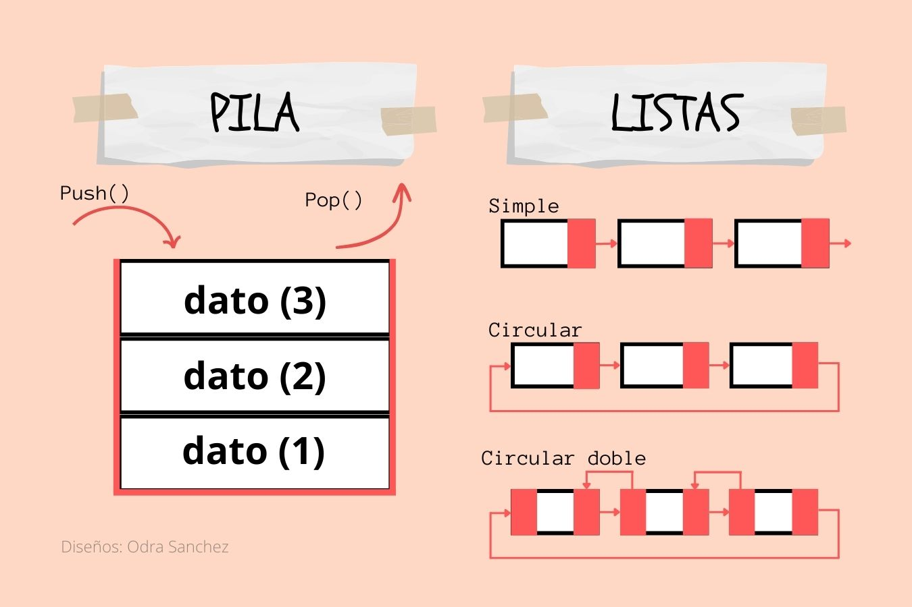

# C - Introducción con ejercicios

_Repositorio con compendio de ejercicios académicos para la introducción al lenguaje C, el contenido refuerza conocimientos de estructuras de datos, operadores y desarrollo de algunos algoritmos._
 

## Situación de repositorio 📊️
    

 

### Tecnologías utilizadas 🔨
 

### Notas importantes ⚠
  - El idioma del contenido de los archivos así como de comentarios está en Español (MX).
  - Todos los archivos se encuentran comentados.

 

## Data_structures - Directorio
Las practicas contenidas dentro de este repositorio son las estructuras que permiten manejar datos, para fines académicos se utilizaron como base datos de tipo ENTERO. Los programas hacen el llamado a un archivo _.h_ que contiene las definiciones de las funciones y los datos con los que se trabaja en el archivo _.c_.

Las estructuras se encuentran divididas por: *Pila, Listas (simples, doble, circular y circular doblemente enlazada), Cola y Árbol*

  

## Exercises - Directorio
Dentro del directorio se encuentran algunos ejercicios solicitados en clases, algunos cuentan con descripción del problema. Los programas se encuentran ordenados por los temas abarcados desde nivel medio superior a primer semestre de nivel superior. 

## Projects - Directorio
--

 

# LICENCIA ✅
El repositorio es resultado de la recopilación de información sobre los usos de etiquetas y elementos gráficos de HTML y CSS con <b>fines académicos</b>.
